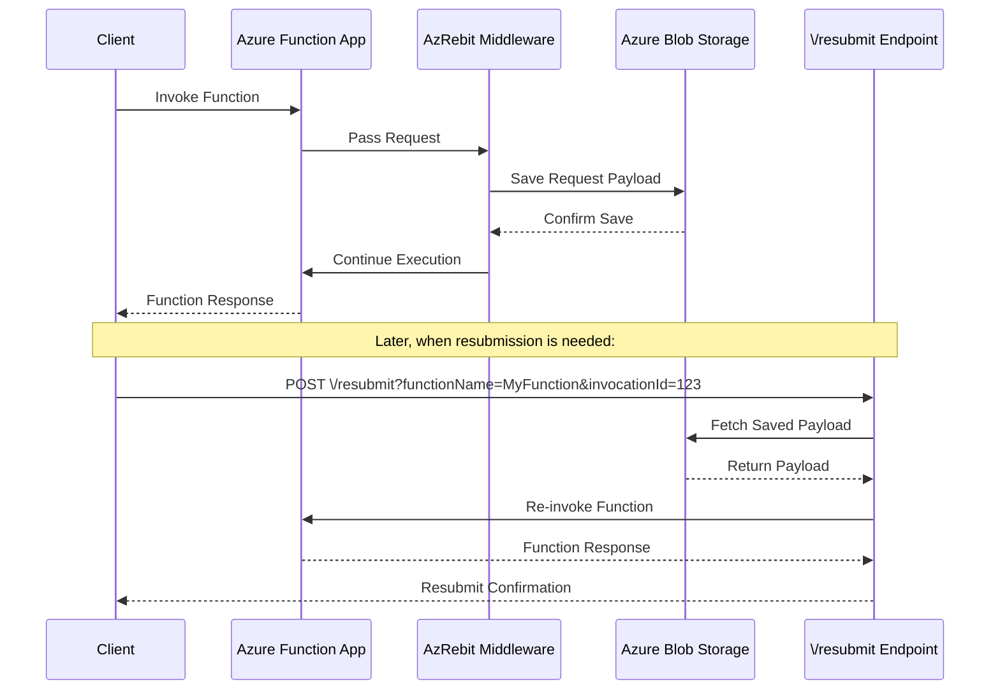

<div align="center">
  
  
  
  <h1 style="font-size: 3.5em; margin: 0.2em 0;">AzRebit</h1>
  
  ### 🔄 A powerful NuGet package for Azure Functions request resubmission

  *Easily integrate request resubmission capability into your Azure Functions applications with minimal configuration*
  
</div>

---

## Overview 

This package adds a `/resubmit` HTTP endpoint to your Azure Functions application, allowing you to programmatically trigger resubmission of failed or pending function executions. 
Perfect for implementing retry logic, handling transient failures, or integrating with external monitoring and alerting systems.

### Problem statement
Azure Functions can fail. No mattter the retry mechanisms in place. We also might have sensitive apps and we want the ability to resubmit a failed request manually.

We might run different dashboards, workbooks that are showing our apps run status. 
With this nuget package you can enrich your monitoring by integrating the ``/resubmit`` endpoint to be called directly from your dashboard.

### Example use case

> **📊 Architecture Diagrams**: The following diagrams are rendered using Mermaid. If you're viewing this README in an environment that doesn't support Mermaid rendering, you can view the live version on GitHub or use a Mermaid-compatible viewer.

```mermaid
graph TB
    subgraph "Azure Function Application"
        A[Function App] --> B[AzRebit Package]
        B --> C[Function Discovery]
        B --> D[Middleware Registration]
        B --> E[\/resubmit Endpoint]
        
        C --> C1[Scan Assemblies]
        C1 --> C2[Find [Function] Methods]
        C2 --> C3[Cache Trigger Data]
        
        D --> D1[IFunctionsWorkerMiddleware]
        D1 --> D2[Save Incoming Request]
        D2 --> D3[Store in Blob Storage]
        D3 --> D4[Tag with InvocationId]
        
        E --> E1[POST /resubmit]
        E1 --> E2[Lookup Function]
        E2 --> E3[Fetch Saved Payload]
        E3 --> E4[Re-trigger Function]
    end
    
    subgraph "Azure Storage Account"
        D3 --> F[Blob Container]
        F --> F1[http-resubmits/]
        F --> F2[queue-resubmits/]
        F --> F3[blob-resubmits/]
        F --> F4[timer-resubmits/]
    end
    
    subgraph "External Systems"
        G[Monitoring Dashboard] --> E
        H[Logic Apps] --> E
        I[Application Insights] --> E
    end
    
    style A fill:#e1f5fe
    style B fill:#f3e5f5
    style E fill:#e8f5e8
    style F fill:#fff3e0
```

>The inspiration for this package came from the 🔄 Resubmit  feature in Logic apps.


## How It Works

The diagram above shows the basic flow of AzRebit. Here's what happens:

1. **Install AzRebit** - Add the NuGet package to your Azure Function project
2. **Automatic Integration** - AzRebit automatically discovers your functions and registers middleware
3. **Request Capture** - When your function runs, the incoming request is saved to Azure Functions storage
4. **Resubmit Endpoint** - AzRebit exposes a Resubmit HTTP endpoint that can re-trigger any captured function
5. **Simple Resubmission** - Call the endpoint with function name and invocation ID to resubmit any request


## Features

- **Automatic Function Discovery** - Automatically discovers and catalogs all functions in your application
- **Authentication** - Endpoint being added is again an azure function which is using the built-in auth via Function.Key
- **Simple HTTP Interface** - RESTful endpoint for triggering resubmissions (HTTP, Blob, Queue, Timer)
- **Native ServiceBus Integration** - Leverages Azure ServiceBus native deadlettering for failed messages
- **Invocation Tracking** - Track resubmissions using invocation IDs
- **Isolated Worker Compatible** - Seamless integration with Azure Functions isolated worker model
- **Zero Configuration** - Works out of the box with sensible defaults

## Requirements

- .NET 8 or higher
- Azure Functions Worker SDK v1.0 or higher
- Azure Functions isolated worker model

## Installation

Install the NuGet package:

```
dotnet add package AzFunctionResubmit
```

Or via Package Manager Console:

```
Install-Package AzFunctionResubmit
```

## Quick Start

To configure AzFunctionResubmit configure `AddResubmitEndpoint();`

### Configure in Program.cs

```csharp
using AzFunctionResubmit;
using Microsoft.Azure.Functions.Worker;
using Microsoft.Azure.Functions.Worker.Builder;

var builder = FunctionsApplication.CreateBuilder(args);

builder.ConfigureFunctionsWebApplication();

//just add
builder.AddResubmitEndpoint();

builder.Build().Run();
```

### Advanced Configuration

You can configure the resubmit behavior with options:

```csharp
builder.AddResubmitEndpoint(options =>
{
    // Exclude specific functions from resubmit functionality
    options.ExcludedFunctionNames.Add("FunctionToSkip");
});
```


#### Supported Triggers
You can use this package if your azure function is triggered by:

- `HttpTrigger` --> saves incoming to `http-resubmits`
- `BlobTrigger` --> saves incoming to `blob-resubmits`
- `QueueTrigger` --> saves incoming to `queue-resubmits`
- `TimerTrigger` --> Not yet available - in progress
- `ServiceBusTrigger` --> > Not yet available - in progress

Every function in your project, with these listed trigger attributes, will have appropriate resubmit functionality.

### Recommendation

Since the resubmition is best used just for failed requests, keeping successfull runs might increase storage size. You can delete the saved request within your function by injecting `IRebitStoreOperations` and calling `DeleteResubmitFile()` method in case of a successful execution.

```csharp
//optional - delete the saved request. Usually you would want this if your function runs successfully
public class MyFunction
{
    private readonly IRebitStoreOperations _rebitStore;

    public MyFunction(IRebitStoreOperations rebitStore)
    {
        _rebitStore = rebitStore;
    }

    [Function("MyFunction")]
    public async Task Run([HttpTrigger(AuthorizationLevel.Function, "get", "post")] HttpRequest req)
    {
        try
        {
            // Your function logic here
            await ProcessRequest(req);
            
            // If successful, delete the saved request
            var invocationId = req.FunctionContext.InvocationId;
            await _rebitStore.DeleteResubmitFile(invocationId);
        }
        catch (Exception)
        {
            // If failed, keep the saved request for potential resubmission
            throw;
        }
    }
}
```

Additionaly you can setup a Lifecycle Management policy on your storage account to automatically delete blobs older than a certain number of days.

The diagram above illustrates the complete flow of AzRebit. Here's the step-by-step process:

1. **Function Discovery** - On startup, the package automatically scans assemblies and discovers all methods decorated with the `[Function]` attribute
2. **Registration** - Discovered function names alongside its trigger data are cached for quick lookup
3. **Middleware** - Before your function starts, middleware `IFunctionsWorkerMiddleware` will be invoked to save the incoming request to Azure Blob Storage and tag it with the unique InvocationId derived from the function context
4. **Storage Organization** - Saved requests are organized in blob containers by trigger type (`http-resubmits/`, `queue-resubmits/`, `blob-resubmits/`, `timer-resubmits/`)
5. **Resubmit Handling** - Incoming requests to `/resubmit` are cross-referenced with the triggers we support and accordingly the payload is pulled from its saved location and sent again to the Function's trigger

### Request Flow



## Making a Resubmit Request

Making a resubmit request depends on two important query params:
**functionName** and **invocationId**

`functionName` --> Name of Azure function as defined inside `[Function()]`  
`invocationId` -->Each function run has a uniqueId coming from the ``FunctionContext``. That Id is used to tag and locate the payload to resubmit.
To locate what is the unique id of you run you need to inspect your logs and search for InvocationId property. [InvocationIdProperty](https://learn.microsoft.com/en-us/dotnet/api/microsoft.azure.functions.worker.functioncontext.invocationid?view=azure-dotnet)

```bash
curl -X POST "http://localhost:7071/api/resubmit?functionName=MyFunction&invocationId=abc-123-def-456" \
```

>In case of **HTTP triggers** the invocationid can be a custom. If you add a header ``x-azrebit-invocationid`` with a custom value **that value will be used as invocationId**.

## API Reference

### Endpoint

**POST** `/resubmit`

### Query Parameters

| Parameter      | Required | Description                                         |
| -------------- | -------- | --------------------------------------------------- |
| `functionName` | Yes      | Name of the Azure Function to resubmit              |
| `invocationId` | Yes      | Unique identifier to fetch the resubmission context |

### Responses

#### 202 Accepted

Resubmit request successfully queued.

```json
{
  "message": "Resubmit request queued for function 'MyFunction'",
  "functionName": "MyFunction",
  "invocationId": "abc-123-def-456",
  "timestamp": "2025-01-01T12:00:00Z"
}
```

#### 400 Bad Request

Missing required query parameters.

```json
{
  "error": "Missing required query parameter: functionName"
}
```

#### 401 Unauthorized

Invalid or missing API key.

```json
{
  "error": "Unauthorized: Invalid or missing API key"
}
```

#### 404 Not Found

Function does not exist in the application.

```json
{
  "error": "Function 'MyFunction' not found"
}
```

#### 500 Internal Server Error

Server error occurred while processing the request.

```json
{
  "error": "Internal server error"
}
```

## Contributing

For now I am not accepting contributions.

## License

This project is licensed under the MIT License - see the LICENSE file for details.

## Support

The package is not yet fully tested on production. If you notice any issues feel free to open one.
For issues, feature requests, or questions, please open an issue on [GitHub](https://github.com/FlipFlop17/azure-functions-resubmit-endpoint/issues).
